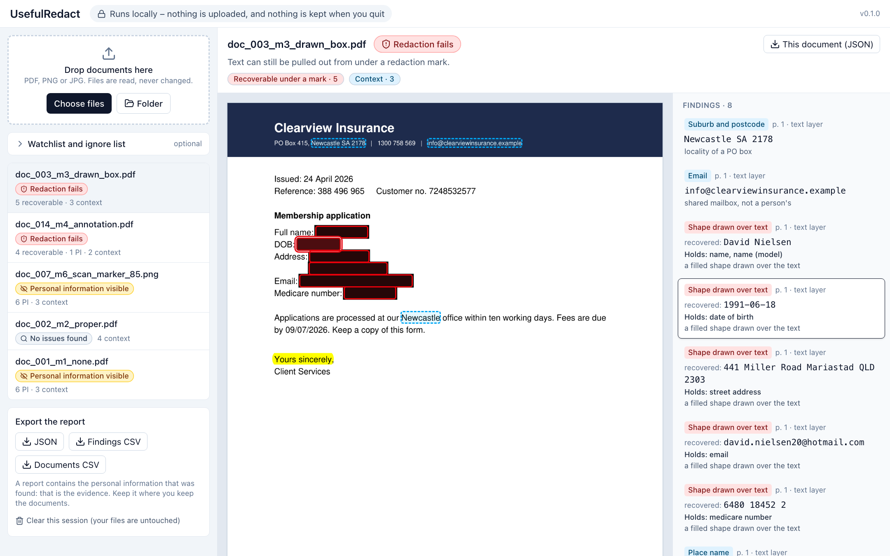
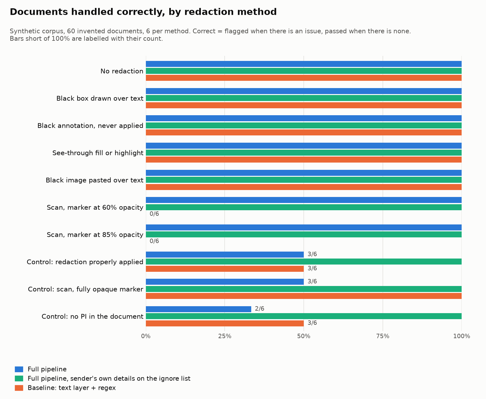

# UsefulRedact

Checks whether the redaction in a document actually holds, before you send it
anywhere. It runs entirely on your machine.

A black box drawn over text hides the words from the eye and leaves them in the
file, where copy and paste will find them. UsefulRedact reads PDFs, scans and
images the way someone trying to recover the text would, and shows what it
found on the page: text still sitting under a box, an annotation or a pasted
image; text a marker pen let through on a scan; personal information left in
plain view.

**It is a checker, not a guarantee.** It never says a document is safe. The best
verdict it gives is "no issues found", which means nothing was detected, not
that nothing is there. It misses things (see [Limitations](#limitations)), so
every finding is shown where it sits on the page for a person to decide. It
never changes a file.



*A synthetic letter. The boxes look like redaction; the panel on the right is
what was still in the file under them.*

Prompted by seeing how often documents arrive with redaction that doesn't
hold. One of the "Useful" family of tools from
[tuoa-tools](https://github.com/tuoa-tools), and built on
[UsefulText](https://github.com/tuoa-tools/usefultext)'s OCR engine and app
pattern.

## Install

Download from the [releases page](https://github.com/tuoa-tools/usefulredact/releases).
Everything is inside (the OCR engine and its models, the name model, the UI), so
nothing is downloaded when you install it or when you run it.

- **macOS**: the zip for your Mac (`macos-arm64` for Apple Silicon, `macos-x64`
  for Intel); unzip and drag UsefulRedact to Applications. The app is not
  notarised by Apple, so macOS refuses to open it until the quarantine flag it
  put on the download is cleared. Once, in Terminal:

  ```
  xattr -d com.apple.quarantine /Applications/UsefulRedact.app
  ```

  Then open it as usual. ("No such xattr" means the flag is already gone.)
  Apple's own route, System Settings → Privacy & Security → Open Anyway, has
  proved unreliable on recent macOS for the other tools in this family, which
  is why the command comes first. The first launch can be slow while macOS
  checks the new files.
- **Windows**: `UsefulRedact-windows-x64-setup.exe`, a per-user install with no
  administrator needed. SmartScreen may want "More info → Run anyway" once.
- **Linux**: unpack the tarball and run `UsefulRedact/UsefulRedact`.

It opens in your browser and has no window of its own. On macOS its Dock icon
shows that it is running. To stop it, use **Quit** on the page, or just close
the tab: it stops by itself two minutes later.

**With Python 3.13 instead**, the wheel on the same page has the UI inside it:

```
python3.13 -m venv .venv
.venv/bin/pip install https://github.com/tuoa-tools/usefulredact/releases/download/v0.1.2/usefulredact-0.1.2-py3-none-any.whl
.venv/bin/usefulredact-app
```

On Windows the commands are `.venv\Scripts\pip` and `.venv\Scripts\usefulredact-app`.
This is also how to get the `usefulredact` command line.

## Results at a glance

Measured on a **synthetic** corpus of 60 invented documents, never on real ones
([the full evaluation](#evaluation), with its limits, is below):

| Documents with an issue, by what was done to them | Flagged by the full pipeline | Flagged by a naive baseline (text layer + regex) |
|---|---|---|
| Black box drawn over the text | 6 of 6 | 6 of 6 |
| Black annotation, never applied | 6 of 6 | 6 of 6 |
| See-through fill or highlight | 6 of 6 | 6 of 6 |
| Black image pasted over the text | 6 of 6 | 6 of 6 |
| No redaction at all | 6 of 6 | 6 of 6 |
| Scan, marker pen at 60% opacity | 6 of 6 | **0 of 6** |
| Scan, marker pen at 85% opacity | 6 of 6 | **0 of 6** |
| **All documents with an issue (recall)** | **42 of 42 (100%)** | **30 of 42 (71%)** |

These count documents, not every piece of personal information in them. Of the
18 documents with nothing wrong, where the right number to flag is none, 10
were flagged: nine for the sending
organisation's own street address or landline, which the checker cannot tell
from a person's, and one where the name model took a firm's name for a
person's. That firm is the sender of its letter. With each sender's own name,
address and phone number on an ignore list, none were flagged.

## Using it

### The app

Installed from a download, open UsefulRedact. From the wheel, run
`.venv/bin/usefulredact-app`. From source, build the UI once first, with Node 24:

```
cd frontend && npm ci && npm run build && cd ..
.venv/bin/usefulredact-app
```

It opens in a browser tab. Drop in files or a folder; each gets a verdict badge;
open one to see every finding boxed on the page, with the text that was
recovered beside it. Click a box or a row to find the other. For a PDF, "draw
the page without its annotations" shows what an annotation was covering.
Closing the tab stops the app after two minutes, once nothing is being checked;
having another tab in front, or closing the laptop lid for a moment, does not.

**It does not wait for you indefinitely.** Left untouched for 30 minutes with
documents loaded, it asks whether you are still there, and two minutes later
takes what it found off the page, deletes its copies and stops. What it shows is
personal information, and a screen nobody is watching is the wrong place for
it. Anything you do on the page starts the clock again, and it does not run
while documents are still being checked. If the app stops for any other reason
while the tab is open, the page says so, and what it was showing can no longer
be read as current.

### The command line

```
.venv/bin/usefulredact check letters/ scan.png --out report/
.venv/bin/usefulredact check letters/ --watchlist names.txt --ignore ours.txt
```

Folders are walked for PDF, PNG and JPG files. It prints a verdict per file and
writes `report.json`, `documents.csv` and `findings.csv`. `--strict` exits with
status 1 when anything is flagged, for use in a script.

## Verdicts

One per document, most serious first:

| Verdict | Meaning |
|---|---|
| `FAIL_RECOVERABLE` | Text is still extractable under a redaction mark (box, annotation, layer, pasted image), or is in the file without showing on the page |
| `PI_VISIBLE` | Personal information (PI) detected in visible or OCR-readable text, in a form field, or in the file's metadata |
| `REVIEW_LOW_CONFIDENCE` | A page could not be read well enough to assess; it needs a human look |
| `NO_ISSUES_FOUND` | Nothing detected. Not a guarantee |

A file that cannot be opened is reported as `NOT_CHECKED`, never as a pass.

Place names and an organisation's shared mailbox are reported as *context*:
shown and exported, but they do not change a verdict on their own. A city in a
letterhead is not personal information.

## How it works

1. **Read the page.** A PDF page with a text layer gives words with boxes. A
   scanned page or an image is rendered and read by OCR, which gives lines with
   boxes and a confidence for each.
2. **Look under the marks** (PDF text layer). Two questions are asked of every word:
   - *Does it render?* The page is drawn to pixels and the word's box examined.
     A word whose box comes out as one flat colour cannot be read on the page,
     whatever did it: a black or white box, an annotation, a pasted image, white
     or invisible text. It is still in the file, so it is recoverable. White
     text on a dark banner keeps its contrast and is left alone.
   - *Is it under a mark that only looks like redaction?* A dark see-through
     fill or highlight, a redaction annotation that was marked and never
     applied, a thick ink stroke. The text may show through, so the mark itself
     is the evidence.

   A properly applied redaction removes the words, so there is nothing to find.
3. **Look through the marker** (scans). When a scan has dark strokes, a second
   OCR pass reads a contrast-stretched copy, which turns "dark grey on black"
   back into something legible. A page the engine read poorly is gated to
   `REVIEW_LOW_CONFIDENCE` rather than passed.
4. **Look for personal information** in everything that could be read: email,
   Australian phone numbers, dates beside a date-of-birth label, Medicare
   numbers and tax file numbers (both with their checksums), Australian street
   addresses, names, and an optional watchlist of names matched exactly, within
   OCR noise, and by one part of the name on its own. An ignore list drops what
   you know is fine, such as your own organisation's address.
5. **Show it.** Every finding carries its page and box, so the app can draw it
   where it sits. Reports export as JSON and CSV.

### The machine learning, exactly

Two models, both small, both running locally on the CPU, inside a pipeline that
is otherwise rules:

- **OCR** is a neural network: RapidOCR (PP-OCR text detection and recognition
  models) on ONNX Runtime. Its confidence is the engine's own certainty about
  what it read, not a measure of accuracy.
- **Names** come from spaCy's `en_core_web_sm`, a small statistical
  named-entity model (PERSON changes a verdict; GPE and LOC are context). It
  misses names and misreads things: in testing it called Australian cities and
  company names people, which is why a place-name list and a labelled-name rule
  ("Name: ...", "Dear ...") sit around it.

Everything else (the render check, the mark checks, the checksums, the patterns,
the fuzzy watchlist) is deterministic code. There is no large language model
and no cloud service anywhere in it.

## Evaluation

**On synthetic data only.** Every document in the corpus is invented: letters
and forms generated from a seed with [Faker](https://faker.readthedocs.io)
(`en_AU`), with one redaction method applied to each, so the right answer is
known by construction. These figures describe how the checker behaves on the
failure modes the corpus contains. They are not an accuracy claim about real
documents.

<!-- results:start -->
60 documents, six for each of ten methods, generated with `--seed 42`. An
*issue* is any verdict other than `NO_ISSUES_FOUND`.

| | Full pipeline | Full pipeline, with the sender's own name, address and phone on the ignore list | Baseline: text layer + regex |
|---|---|---|---|
| Documents with an issue that were flagged (recall) | **42 of 42** | 42 of 42 | 30 of 42 (71%) |
| Documents with no issue that were flagged (false positives) | 10 of 18 | **0 of 18** | 6 of 18 |
| Exactly the expected verdict | 50 of 60 | 60 of 60 | it has only one answer |

Every document with a failed redaction was flagged, by every route the corpus
tries: a box drawn over the text, an annotation that was never applied, a
see-through fill or highlight, a black image pasted on top, and marker pen over
a scan at 60% and 85% opacity. That is a statement about documents, not about
every piece of PI in them: the last table in this section counts those, and a
few were missed. The baseline flags the digital documents, since the words are
sitting in the text layer, and none of the scans.

**The false positives are the honest part.** Half the letters in every method
carry, by construction, something of the *sender's* that looks like PI: its
street address, or a landline. The checker cannot tell whose address it is, so
it flags them: that accounts for 9 of the 10. The tenth is the name model
reading the firm "Johnson Plumbing" as a person. That firm is the sender of the
letter, so its name goes on the ignore list along with its address and phone
number; with all three in place, which is how the tool is meant to be used,
none remain. The name is doing the work there: with only the address and phone
listed, that document is still flagged.



The chart counts documents handled *correctly*; the two tables below count
documents *flagged*. For the seven methods with an issue those are the same
thing. For the three controls they are opposites: 4 of 6 flagged is 2 of 6
handled correctly, and 0 of 6 flagged is the right answer.

**Recall by redaction method** (documents with an issue that were flagged; the
right answer is all of them):

| Method | What was done | Expected verdict | Full pipeline | Baseline: text layer + regex |
|---|---|---|---|---|
| `m1_none` | no redaction | `PI_VISIBLE` | 6/6 (100%) | 6/6 (100%) |
| `m3_drawn_box` | black rectangle drawn over live text | `FAIL_RECOVERABLE` | 6/6 (100%) | 6/6 (100%) |
| `m4_annotation` | black annotation, never applied | `FAIL_RECOVERABLE` | 6/6 (100%) | 6/6 (100%) |
| `m5_see_through` | dark see-through fill or highlight | `FAIL_RECOVERABLE` | 6/6 (100%) | 6/6 (100%) |
| `m8_pasted_image` | black image pasted over live text | `FAIL_RECOVERABLE` | 6/6 (100%) | 6/6 (100%) |
| `m6_scan_marker_60` | scan, marker at 60% opacity | `PI_VISIBLE` | 6/6 (100%) | 0/6 (0%) |
| `m6_scan_marker_85` | scan, marker at 85% opacity | `PI_VISIBLE` | 6/6 (100%) | 0/6 (0%) |
| | **all seven** | | **42/42 (100%)** | **30/42 (71%)** |

The baseline flags a failed redaction in a digital PDF as readily as the full
pipeline does, and gives the same answer for all of them: "there is PI in the
text layer". It cannot say that the text is under a box someone believed had
removed it, which is the finding that matters, and it cannot read a scan at all.

**False positives on the controls** (documents with no issue that were flagged;
the right answer is 0 of 6, so every number here is a count of errors):

| Method | What was done | Full pipeline | With the sender's details on the ignore list | Baseline |
|---|---|---|---|---|
| `m2_proper` | redaction properly applied | 3/6 | 0/6 | 3/6 |
| `m6_scan_marker_100` | scan, fully opaque marker | 3/6 | 0/6 | 0/6 |
| `m7_control` | no PI in the document | 4/6 | 0/6 | 3/6 |
| | **all three** | **10/18** | **0/18** | **6/18** |

A document is flagged if *any* of its PI is found, so the table above hides
individual misses. Counted piece by piece, where the PI is there to be read:

| PI type | Text layer, unredacted | OCR, through marker at 60% | OCR, through marker at 85% |
|---|---|---|---|
| name | 11/11 | 11/11 | 10/10 |
| date of birth | 3/3 | 3/3 | 4/5 |
| address | 9/10 | 7/8 | 8/8 |
| email | 5/5 | 4/4 | 5/5 |
| phone | 5/5 | 3/3 | 3/3 |
| Medicare number | 4/4 | 4/4 | 4/4 |
| tax file number | 4/4 | 4/4 | 4/4 |

A digital PDF takes about 0.1 s; a scanned page about 6 s (two OCR passes, CPU
only, on a 2019 Intel laptop).

The figures were measured with the package versions in
[constraints.txt](constraints.txt) (ONNX Runtime 1.23.2, RapidOCR 3.9.2, spaCy
3.8.16, PyMuPDF 1.28.2), which is also what CI installs. An install without
that file takes the newest versions `pyproject.toml` allows. That was tried by
hand on Windows with ONNX Runtime 1.30 on a 20-document corpus: every document
with a failed redaction was flagged, and the only verdicts that differed from
the expected ones were the false positives described above. A neural model on a different
runtime is not promised to read every character identically, though, so the
file is there for anyone who wants these exact numbers.
<!-- results:end -->

The full report, with every false positive and its cause, is in
[eval/eval_report.md](eval/eval_report.md). To reproduce it:

```
pip install -e ".[dev]"
python -m usefulredact.corpus --n 60 --seed 42
python -m usefulredact.evaluate
```

### What the evaluation does not show

- **The same hands wrote the generator and the detectors.** The corpus tests
  that the mechanisms work on the failure modes it was built to contain. It
  cannot say how many failure modes exist in the wild that it does not contain.
- **Sixty documents, six per method.** A single document is 17 percentage
  points of a method's score.
- **How it was run.** Detectors were tuned against corpora from other seeds.
  The seed-42 corpus was looked at twice: once before a flaw in the generator
  was fixed (look-alike details had been left to chance, which handed the
  controls most of them; they are now stratified across methods), and once for
  the figures above. One detector fix came from looking at a seed-42 document
  in the app: OCR had glued the label "Email" onto an address.
- **The baseline is deliberately naive**, and on digital PDFs it does as well as
  the full pipeline at the yes/no level: if the words are in the text layer, a
  regex finds them. What it cannot do is say *why* a document is flagged
  (recoverable text under a box, versus PI nobody tried to hide), read a scan,
  or find a name.

## Run from source

To work on it, or to reproduce the evaluation:

```
git clone https://github.com/tuoa-tools/usefulredact
cd usefulredact
python3.13 -m venv .venv
.venv/bin/pip install -e . -c constraints.txt
```

`-c constraints.txt` installs the versions the tests and the evaluation were
run with; leave it off to take the newest that `pyproject.toml` allows. The UI
is built separately from source (see [The app](#the-app)).

With pip, the name model is a wheel on the spaCy releases page rather than on
PyPI, so that one download comes from GitHub. If it fails with a gateway error,
GitHub is having a moment: run the same command again, or fetch the wheel
yourself and install it from the file. The downloads above do not have this
step; the model is already inside them.

## Privacy

- **Local only.** No network calls at run time: the OCR models ship inside the
  `rapidocr` wheel and the name model is installed as a wheel beside it. The
  app listens on `127.0.0.1` and answers only requests carrying that launch's
  secret.
- **No telemetry**, of any kind.
- **Nothing is kept.** The app copies dropped files into a private temporary
  folder to read them, and deletes it when it stops: on Quit, when the tab has
  been closed for two minutes, when the session has been left untouched for 30 minutes, on Ctrl+C, on a termination signal, and on
  Windows when the console window is closed, at log off and at shut down. A
  process that is killed outright (`kill -9`, a power cut) cannot clean up after
  itself; the next start finds that folder and deletes it. The watchlist and
  ignore list live in memory. Nothing is logged to a file.
- **Your files are only read**, never written to.
- **A report contains the personal information that was found.** That is the
  evidence a person needs to confirm each finding. Keep exported reports where
  you keep the documents.

## Limitations

- **Handwriting.** The OCR engine reads print. A handwritten page mostly comes
  back as `REVIEW_LOW_CONFIDENCE` or as nothing readable; either way it needs
  eyes.
- **Faces and pictures.** No face detection, no reading of photographs,
  signatures or logos.
- **PI it has no rule for.** Driver licence and passport numbers, bank
  accounts, health details, case numbers, anything identifying only by its
  context. Formats are Australian.
- **Names.** The small model misses names, more so in forms and in OCR text
  than in prose, and unusual names more than common ones. Use the watchlist
  when you know who the document is about.
- **Whose address is it?** It cannot tell an organisation's street address or
  landline from a person's, so it flags both. That is what the ignore list is
  for.
- **The ignore list is blunt.** An entry silences a finding that matches it and
  also any shorter finding contained in it: with "Johnson Plumbing" listed, a
  bare "Johnson" elsewhere in the document is ignored too (a full name such as
  "Anna Johnson" is not). List only what you are sure of.
- **OCR errors.** A misread digit breaks a checksum; a misread letter hides a
  name from an exact match. The fuzzy watchlist helps with names only.
- **Marker on a scan.** It reads what the engine can read through a stroke,
  including after a contrast stretch. A stroke that is nearly but not quite
  opaque can still beat it, and a person with image-editing software may do
  better than it does.
- **Images inside a digital page** are read by OCR only when they cover a good
  part of the page. Attachments and embedded files are not opened.
- **Password-protected and damaged PDFs** are reported as not checked.
- **Rotated pages** are handled in principle and have had little testing.

## Development

```
.venv/bin/pip install -e ".[dev]"
.venv/bin/ruff check . && .venv/bin/ruff format --check .
.venv/bin/pytest -q
cd frontend && npm run lint && npm run typecheck && npm test
```

The tests generate their own fixtures, one small document per redaction method,
and run offline. CI runs them on Ubuntu, Windows and macOS.

| | |
|---|---|
| `usefulredact/pdf_checks.py` | what the page hides: the render check and the mark checks |
| `usefulredact/pipeline.py` | one document: pages, OCR and its second pass, metadata, the verdict |
| `usefulredact/detectors.py`, `ner.py`, `watchlist.py` | finding personal information |
| `usefulredact/pagetext.py` | one page as a string plus boxes, so a match can be drawn |
| `usefulredact/ocr.py` | the RapidOCR wrapper, from UsefulText |
| `usefulredact/corpus.py`, `evaluate.py` | the synthetic corpus and the evaluation |
| `app/` | the local API, the session that keeps nothing, the launcher |
| `packaging/`, `scripts/` | the app bundles and the Windows installer, and the smoke test each must pass |
| `frontend/` | the React UI |
| `PROJECT_DOCS/BRIEF.md` | the specification this was built to |

MIT licence.
